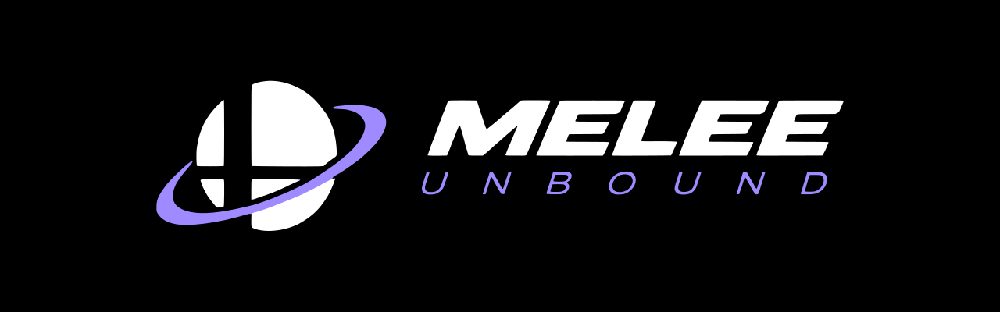

<p align="center">
  <a href="https://melee.hexdump0.pw">
    
  </a>
</p>

<h1 align="center">Melee Unbound</h1>

<p align="center">
  <a href="https://melee.hexdump0.pw/play"></a>
  
  <a href="https://discord.gg/87kwPPetPD"></a>
</p>

A native port of **Super Smash Bros. Melee** (v1.02 / Rev 2, `GALE01`) that
compiles the game's own decompiled source and adds a few quality of life features

> **Bugs/Crashes might be present** This is still in a very early stage and might not be perfect

## What it does

- **Compiles the engine** `src/` comes from the
  [`doldecomp/melee`](https://github.com/doldecomp/melee); the port
  supplies platform behavior (GX, AX, OS, DVD, input, timing) and a small set
  of `#ifdef PORT_PC` portability patches in `patches/`.
- **Renderer.** A GX high-level emulator translates display lists to
  OpenGL/GLES 3, including TEV combiner shaders, texture decode and the
  asset converter that reads models, stages and effects off your disc.
- **Audio.** AX is emulated on the host: a software mixer for the game's
  voices, sequences and ADPCM banks..
- **Mods.** WebAssembly mods run under WAMR through a small host ABI
  (`mod.toml` + `.wasm` in `mods/`). Unbound is the default mod, it includes widescreen,
  the boot movie and the credits
- **Browser.** The same sources compile to wasm32 (Emscripten, SDL3, WebGL2,
  JSPI).
- **Launcher.** A Tauri app for settings, mods and crash reports that can
  download the port from GitHub releases and checks for updates.

## Play it

**In a browser** — <https://melee.hexdump0.pw/play>: 

**Prebuilt releases** — [Releases](https://github.com/HexDump0/melee/releases)
publishes raw binaries, not archives:

| Asset | What it is |
|---|---|
| `melee-linux-x86` | the port, 32-bit, dynamic SDL3 |
| `melee-windows-x86.exe` | the port, 32-bit, SDL3 linked statically |
| launcher bundles | `.deb`, `.AppImage`, `.msi`, `.exe` from the same workflow |

## Build from source

Builds are done on an linux host

**Requirements** (Arch package names in parentheses): a 32-bit toolchain
(`gcc-multilib`), CMake, Ninja, SDL3 (`lib32-sdl3`), and Mesa with 32-bit
EGL/GLESv2. Exact packages and machine setup are in
[`native/AI/TESTING.md`](native/AI/TESTING.md).

```sh
git clone --recurse-submodules https://github.com/HexDump0/melee
cd melee
./scripts/apply_decomp_patches.sh            # idempotent; CMake runs it too
cmake -S native -B build/native -DCMAKE_BUILD_TYPE=RelWithDebInfo
cmake --build build/native -j"$(nproc)"
ctest --test-dir build/native                # full regression suite
```

```sh
native/tools/windows_build.sh /tmp/melee-win /path/to/sdl3-prefix
```

See [`native/AI/reference/windows.md`](native/AI/reference/windows.md) for the
toolchain, the static-link default and what is still unverified there.

For the browser build


```sh
source ~/projects/emsdk/emsdk_env.sh          # Emscripten 6.0.9, pinned
site/scripts/build-play.sh
```

## Running and testing

```sh
./build/native/melee                       # retail frontend, live input
./build/native/melee --match               # a debug match, no menus
./build/native/melee --match 600           # ...for 600 frames, then exit
ctest --test-dir build/native              # headless suite
```

A few switches worth knowing, the full list is in
[`native/AI/TESTING.md`](native/AI/TESTING.md).

| Variable | Effect |
|---|---|
| `MELEE_MATCH_P0`, `MELEE_MATCH_P1`, `MELEE_MATCH_STAGE` | pick the match to run |
| `MELEE_RNG_SEED=0x...` | replay a run exactly |
| `MELEE_MATCH_CPU=1..9` | make both slots CPUs |
| `MELEE_NO_MODS=1` | boot vanilla, with no mods loaded |
| `MELEE_LOG_REPORTS=1` | echo the game's `OSReport` output to stderr |

## Mods

A mod is a directory in `mods/` with a `mod.toml` manifest and a WebAssembly
module; the loader reads both, and each manifest setting becomes a labeled
control in the launcher.

## Repository layout

```
.
├── native/          the port: platform layer, GX HLE, renderer, viewer, tests
│   └── AI/          port agent hub: STATE.md, ROADMAP*.md, TASKS.md, learnings/
├── launcher/        Tauri shell around the port (settings, mods, crashes)
├── site/            the website, including the browser build at /play
├── mods/            WebAssembly mods; unbound/ is the default one
├── patches/         #ifdef PORT_PC portability patches for the decompilation
├── scripts/         setup helpers (patch application)
├── assets/          logo artwork, boot animation, gameplay capture
├── AI/              decompilation agent hub (claims, workflow, learnings)
└── decomp/          git submodule: doldecomp/melee (pinned, never committed into)
```

## Legal

A fan project. Not affiliated with or endorsed by Nintendo. No game assets are
distributed in this repository, and none ever will be: you need your own copy
of Melee v1.02 (`GALE01`) to build or run anything that loads data. The
decompilation in `decomp/` is [`doldecomp/melee`](https://github.com/doldecomp/melee)'s
work under its own terms; the port's own code in `native/`, `launcher/` and
`site/`